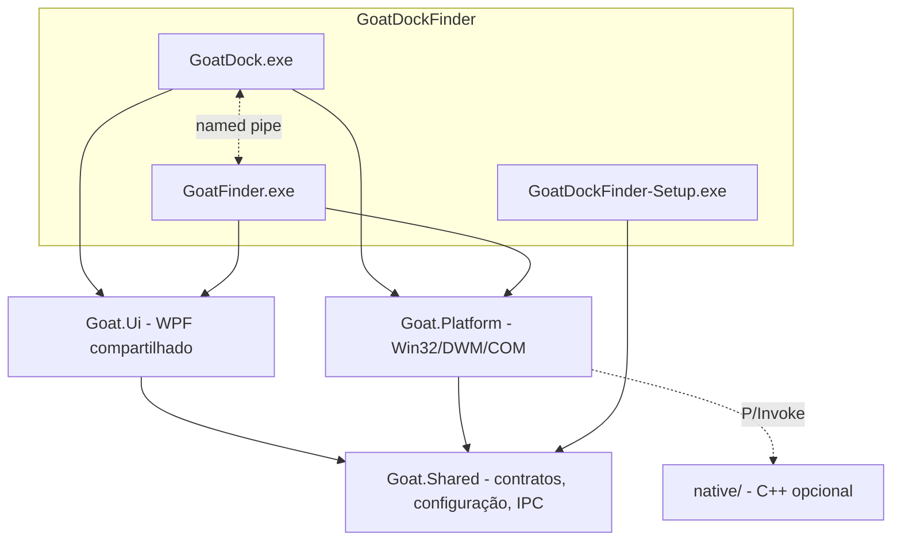

# ADR 0002 — Arquitetura em componentes: GoatDock e GoatFinder

- Status: **Aceita** (decisões em aberto da proposta adotaram os padrões recomendados)
- Data: 2026-10-06

## Contexto

Um produto, **GoatDockFinder**, com dois componentes independentes:

- **GoatDock**: dock, launchpad, widgets, ambientes, efeito gênio.
- **GoatFinder**: barra de menu superior, gerenciador de arquivos, Stage Manager.

Cada um funciona sozinho, pode ser instalado sozinho, e os dois se integram quando ambos existem.

## Decisão

| Projeto | Papel | Pode depender de |
|---|---|---|
| `Goat.Shared` | Contratos, esquema de configuração, mensagens IPC, lógica pura | nada |
| `Goat.Platform` | AppBar, DWM, hooks de janela, monitores, ícones do Shell, captura de janela, diário de alterações | Shared |
| `Goat.Ui` | Tema e controles WPF comuns | Shared |
| `GoatDock` (+ `GoatDock.Core`) | Dock, launchpad, widgets, gênio | Shared, Platform, Ui |
| `GoatFinder` (+ `GoatFinder.Core`) | Barra superior, arquivos, Stage Manager | Shared, Platform, Ui |
| `GoatDockFinder.Installer` | Instalação por componente | Shared |

**Regras (verificadas por teste de arquitetura na fase 3):**
1. `GoatDock` e `GoatFinder` nunca referenciam um ao outro.
2. `Goat.Shared` não referencia ninguém.
3. Só entra na camada compartilhada o que os dois usam ou o que é contrato.
4. Integração só por IPC.

### Responsabilidades

| Recurso | Dono |
|---|---|
| Dock, launchpad, widgets (inclui Spotify), ambientes, multi-monitor da dock, dock sobre janelas | GoatDock |
| Efeito gênio | GoatDock (conhece os ícones; restaurar a partir da dock anima antes de mostrar a janela) |
| Barra superior, menus, status, gerenciador de arquivos | GoatFinder |
| Stage Manager | GoatFinder |
| Personalização do Explorer (camada A) | GoatFinder |

Sem o outro: Finder sem Dock não tem gênio; Dock sem Finder não reserva faixa no topo.

### Integração

Named pipe `\\.\pipe\GoatDockFinder.<SID do usuário>`, JSON versionado definido em `Goat.Shared`. Mensagens iniciais: `Hello`, `DockBounds`, `ActivateWindow`, `AppearanceChanged`. Cada lado reconecta sozinho e funciona sem o outro. Instância única por componente (mutex `Local\GoatDock.<sid>`, `Local\GoatFinder.<sid>`).

### Instalador

Um `GoatDockFinder-Setup.exe` com seleção de componentes, pacotes separados, manifesto `components.json`, modo "Modificar", `--components dock,finder` para automação e desinstalação por componente, revertendo o que foi alterado no Windows.

### Repositório

Novo repositório com histórico limpo, sem remoto. O repositório original não é alterado.

## Estado

Implementado na 1.0.0. Detalhes que mudaram em relação à proposta inicial:

- Goat.Platform ficou com o que os dois componentes usam; serviços exclusivos ficam em GoatDock/Platform e GoatFinder/Platform (sem projeto extra).
- Goat.Shared, GoatDock.Core e GoatFinder.Core usam o TFM 
et10.0-windows, porque o produto só existe para Windows.
- O instalador depende de GoatDock.Core (ler as preferências para restaurar a barra do Windows), Goat.Platform e Goat.Shared.
- As regras de dependência estão em ReleaseArchitectureTests.

## Consequências

Mais projetos e uma camada compartilhada para manter. Em troca: componentes que evoluem e se instalam separadamente, dependências verificáveis e um único ponto para toda alteração do Windows.
